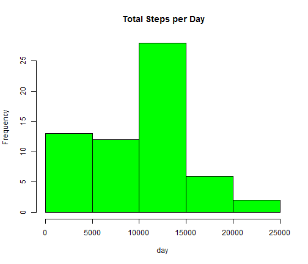
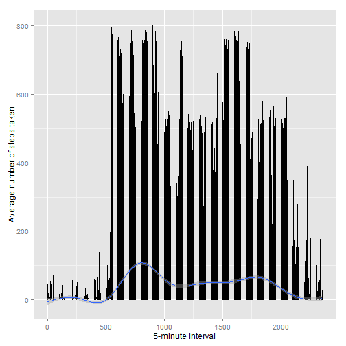
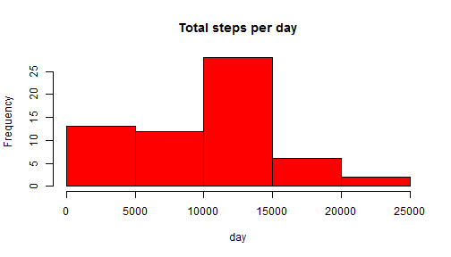
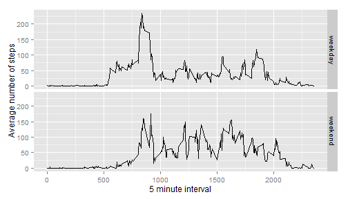

# Reproducible Research: Peer Assessment I

## Step 1:  Loading the data by read .csv file


```r
library(lattice)
library(datasets)
library(ggplot2)
library(scales)
library(Hmisc)
```


```r
fileUrl <- "https://d396qusza40orc.cloudfront.net/repdata%2Fdata%2Factivity.zip"

download.file(fileUrl, destfile= "Factivity.zip")
unzip("Factivity.zip")

activity_data <- read.csv("activity.csv")
```
## Step 2: Preprocessing the data


```r
names(activity_data)
```

```
## [1] "steps"    "date"     "interval"
```

```r
activity_data$date <- as.Date(activity_data$date, "%Y-%m-%d")
```

## Step 3. What is the mean total number of steps taken per day?
###        1. Calculate the total number of steps taken per day

  


```r
totalStepsDay <- tapply(activity_data$steps, activity_data$date, sum, na.rm= TRUE)
```

###        2. Histogram of Total Steps per day

###        Here is a histogram of the data

```r
hist(totalStepsDay, main=" Total Steps per Day", xlab= "day", col= "green")
```

 


## Step 4.  Calculate and report the mean and median total number of steps             taken per day


```{ r, echo=TRUE}

MeanStepsbyDay <- mean(totalStepsDay)

MedianStepsbyDay <- median(totalStepsDay)

```

## Mean: 9354.2295082 
## Median: 10395


## Step 5.  What is the average daily activity pattern?
       
###         1.Make a time series plot (i.e. type = "l") of the 5-minute                 interval (x-axis)and the average number of steps taken,                   averaged across all days (y-axis.)

      
```{ r, echo=TRUE}

time_series <- aggregate(activity_data$steps, by= list(interval= activity_data$interval), FUN= mean, na.rm= TRUE)

```


### Here is a timeseries plot of data

```r
ggplot(data = time_series , aes(x = activity_data$interval, y = activity_data$steps ))+ geom_line() + xlab("5-minute interval") + ylab("Average number of steps taken") + geom_smooth(method= "auto")
```

```
## geom_smooth: method="auto" and size of largest group is >=1000, so using gam with formula: y ~ s(x, bs = "cs"). Use 'method = x' to change the smoothing method.
```

```
## Warning: Removed 2304 rows containing missing values (stat_smooth).
```

```
## Warning: Removed 2 rows containing missing values (geom_path).
```

 


###   Step 6.  Which 5-minute interval, on average across all the days in the             dataset,contains the maximum number of steps?


```r
     time_interval <- tapply(activity_data$steps, activity_data$interval, mean, na.rm= TRUE)

interval_max <- which.max(time_interval)
names(interval_max)
```

```
## [1] "835"
```
     
## Maximum steps: 104


     
##  Step7.Inputing missing values
###        1. Calculate and report the total number of missing values in                the dataset(i.e. the total number of rows with NAs)


``` { r, echo= TRUE}
    NA_activity <- sum(is.na(activity_data))

```

##  Step 8. Number of missing values: 2304


###        1.  Devise a strategy for filling in all of the missing values                in the dataset.

###        2. Create a new dataset that is equal to the original dataset                  but with the missing data filled in.

```{ r, echo=TRUE}

activity_dataImputed <- activity_data
activity_dataImputed$steps <- impute(activty_data$steps, fun= mean)
      

```


###  Step 9 .  Make a histogram of the total number of steps taken each                  day.
###           1. What is the impact of imputing missing data on the                        estimates of the total daily number of steps?

```{ r, echo= TRUE}

totalNewStepsDay <- tapply(activity_dataImputed$steps, activity_dataImputed$date, sum, na.rm= TRUE)

```


##          here is a histogram of the data

```r
hist(totalNewStepsDay, main="Total steps per day", xlab = "day", col= "red")
```

 


##  Step 10. Calculate and report the mean and median total number of steps taken per day.

```{ r, echo= TRUE}

MeanNewStepsbyDay <- mean(totalNewStepsDay)

MedianNewStepsbyDay <- median(totalNewStepsDay)


```

## MeanImputed:   9354.2295082
## MedianImputed: 10395


##  Step 11.  Are there differences in activity patterns between weekdays and weekends?
###          1.  Create a new factor variable in the dataset with two levels - "weekday" and "weekend" indicating whether a given date is a weekday or weekend day.


```r
activity_dataImputed$dataType <- ifelse(as.POSIXlt(activity_dataImputed$date)$wday %in% c(0,6), 'weekend', 'weekday')

averaged_ActivityDataImputed <- aggregate(data= activity_dataImputed, steps~interval+dataType, mean)
```

###  Step 12. Make a panel plot containing a time series plot(i.e type= "l") of the 5 minute interval (x-axis) and the average number of steps taken average number of steps taken, averaged across all weekday days or weekend days (y-axis).


###     Here is a panel plot of the data

```r
ggplot(averaged_ActivityDataImputed , aes(interval, steps)) + geom_line()+ facet_grid(dataType ~ .)+ xlab("5 minute interval") + ylab("Average number of steps")
```

 


